# **Web Design & Dev** - GitHub & VS Code Setup

**Prerequisites:** Visual Studio Code should be downloaded onto your computer and a GitHub account should be made. Git should also be downloaded. Instructions to download git can be found [here](https://git-scm.com/downloads).

**Step 1:** Log in at https://github.com/

**Step 2:** Navigate to the account’s repositories and click `New`

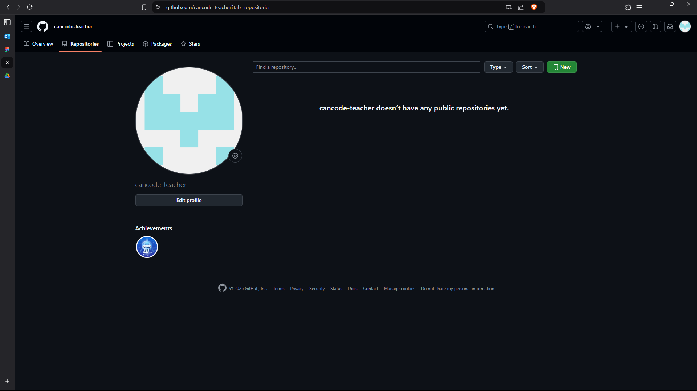

**Step 3:** Name repository to be `<your-username>.github.io`. Set the repository to be public (this is needed to host your website). Then click the `Create repository` button. 

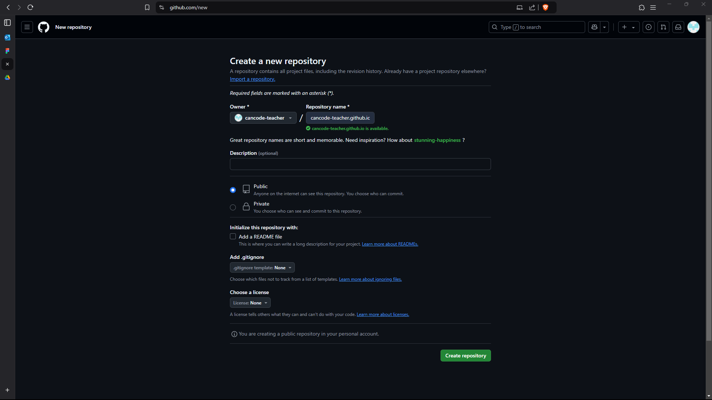

**Step 4:** This will open up a new repository in GitHub.

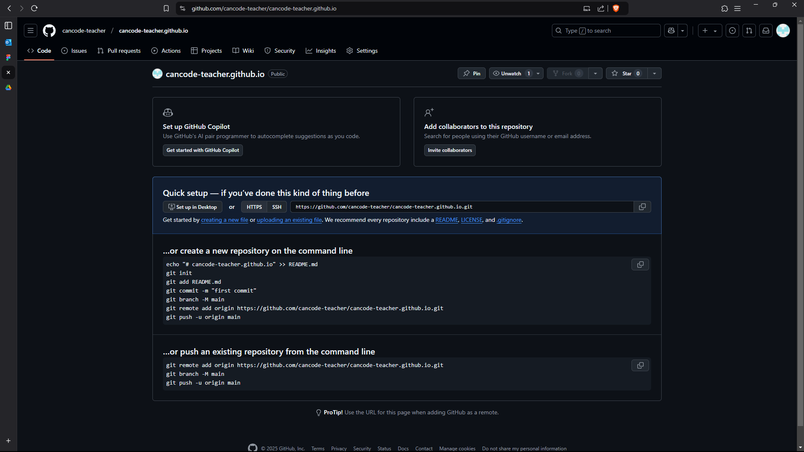

**Step 5:** Open up Visual Studio Code (VS Code). Click `Clone Git Repository…`. 

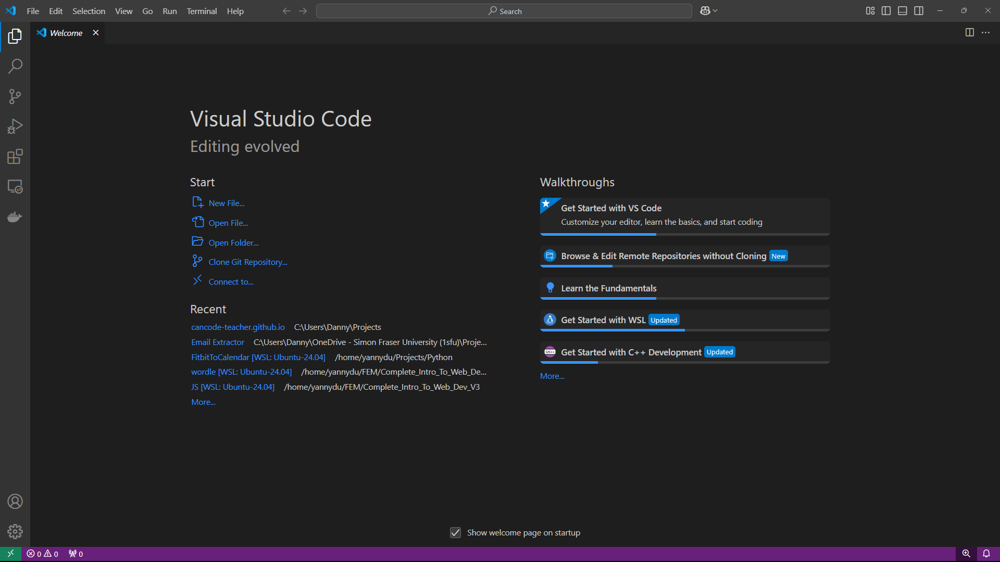

**Step 6:** Click `Sign in to Sync Settings`. 

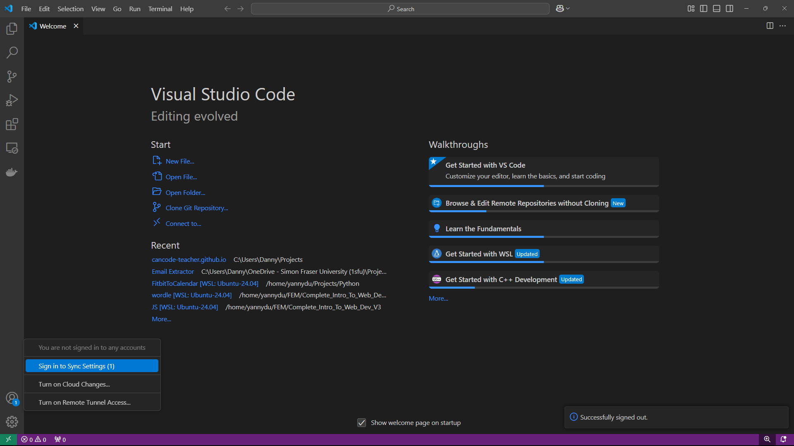

**Step 7:** This will open up the browser and prompt you to select an account to authorize. Click `Continue`.

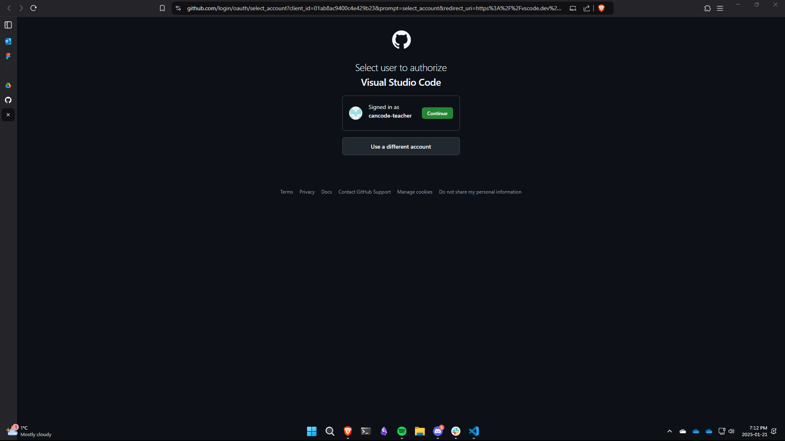

**Step 8:** Back on VS Code you should now see that your GitHub account is synced with the platform. 

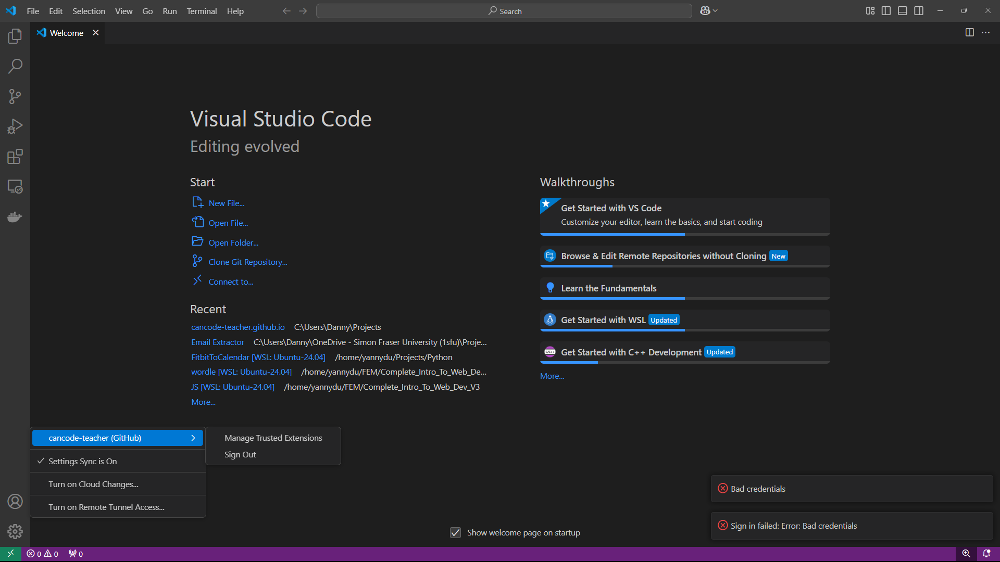

**Step 9:** At the top of VS Code click on the search bar and then select `Clone from GitHub`.

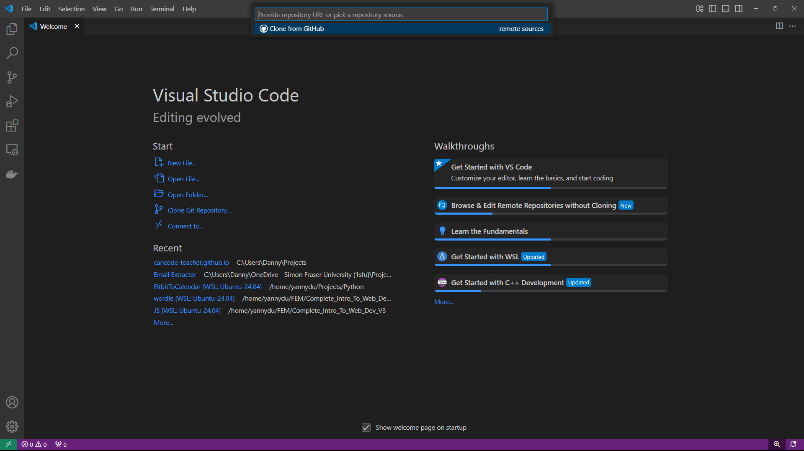

**Step 10:** VS Code will prompt you to sign in to GitHub. Select allow to open up GitHub in your browser.

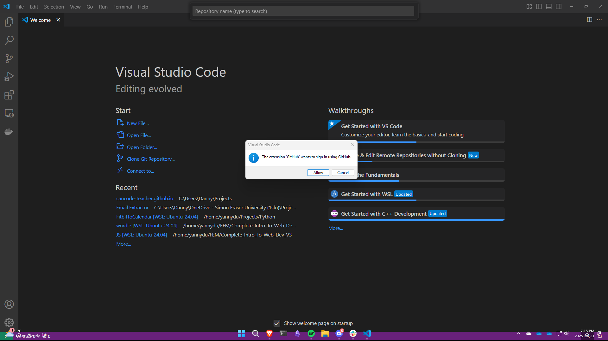

**Step 11:** On the browser, GitHub will prompt you to select a user to authorize. Click continue beside your GitHub account you wish to use.

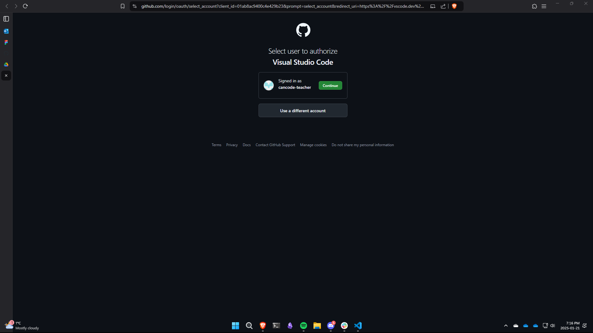

**Step 12:** Next authorize the additional permissions for VS Code.

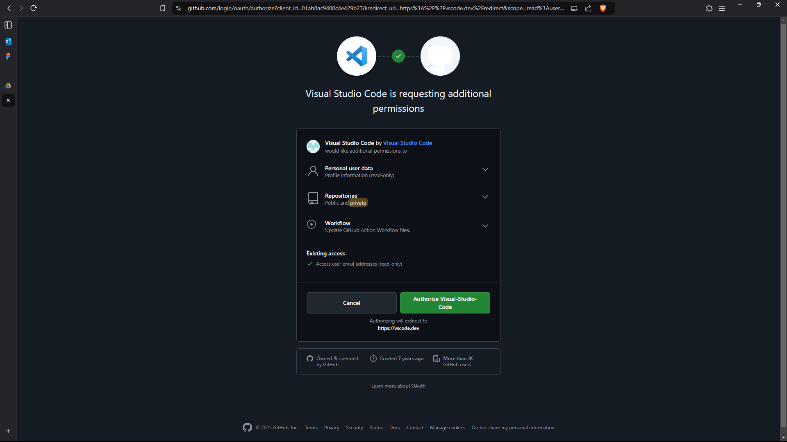

**Step 13:** Back on VS Code, in the top search bar select the repository we made using your GitHub username.

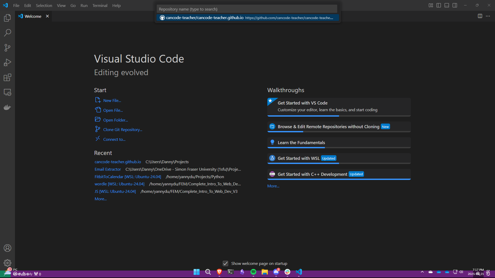

**Step 14:** Next select where you wish to store this folder locally on your computer. Note: you may wish to create a `Projects` folder on your computer.

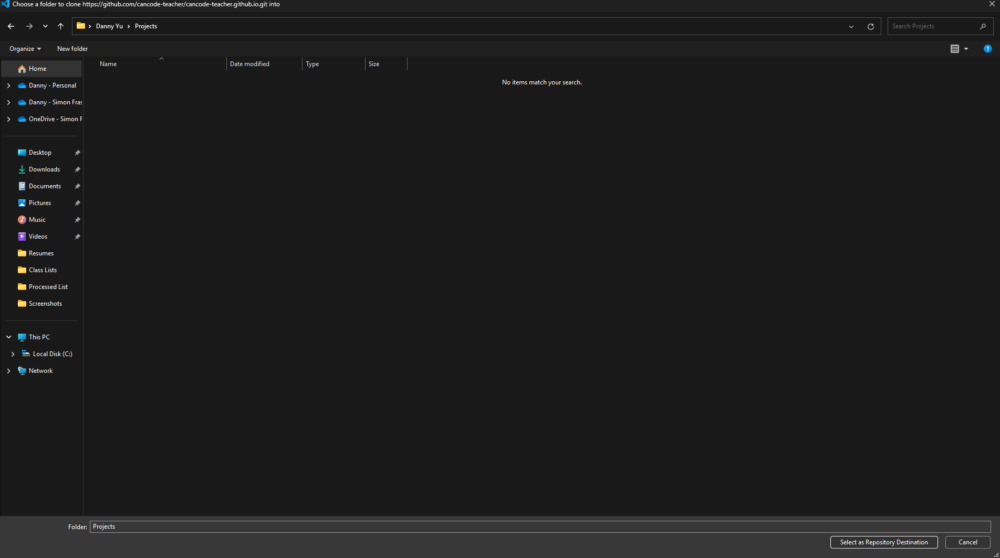

**Step 15:** Once the location has been selected, a popup will appear asking if you would like to open the clone repository. Select `Open`. 

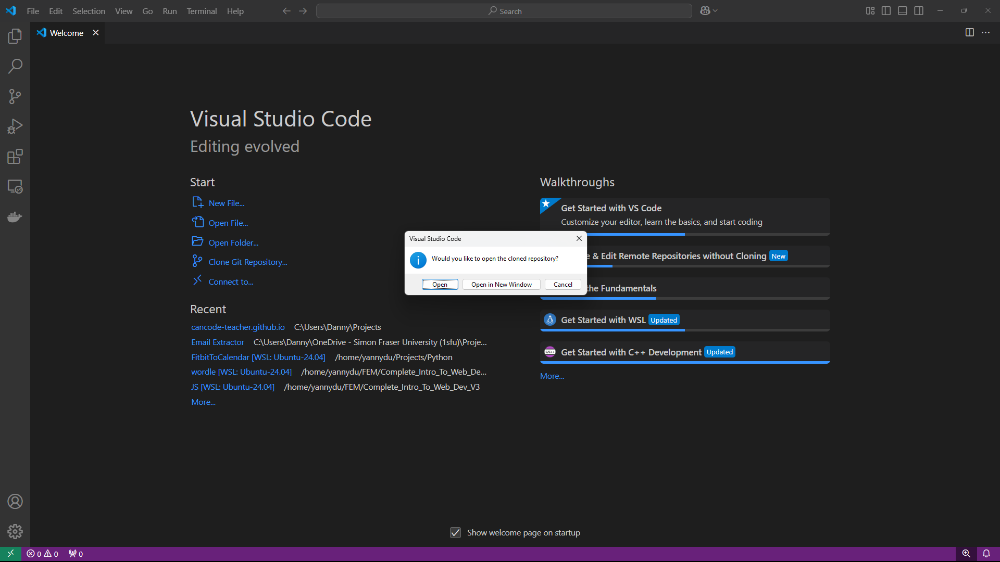

**Step 16:** Your repository is now cloned and you’re ready to start coding! 

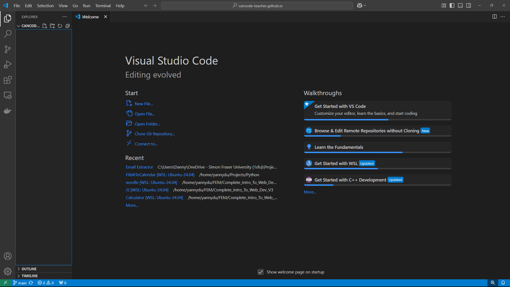