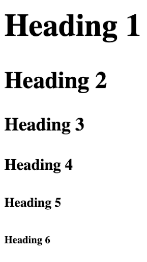
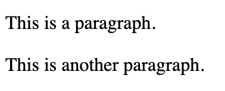
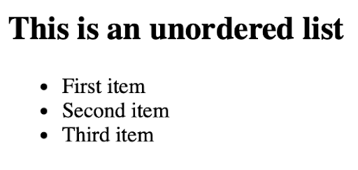
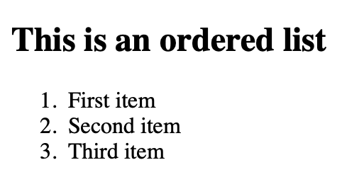
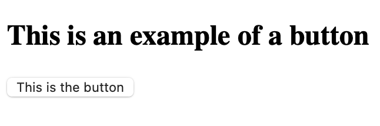
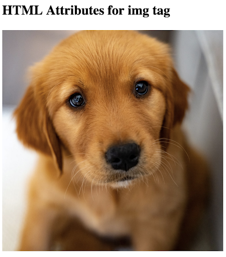
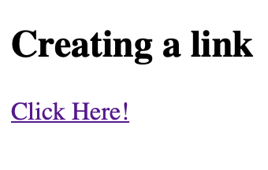

# **Web Design & Dev** - HTML Tags

These are some of the HTML tags we will be using during the program. A document version of these notes can be found [here](https://docs.google.com/document/d/15_44C2JzJJnEGPcBTw0nVTFSGsl3_D_xY7DIJr6cTwA/edit?usp=sharing). 


## Page Structure Tags

```<html>, <head>, <body>, <footer>```
- `html` contains all other html elements
- `head` is for metadata
- `body` holds the actual body of your site
- `footer` for extra information

## Header Tags 
```<h1>, <h2>, <h3>, <h4>, <h5>, <h6>```
- Headers `<h1>` to `<h6>` are used to to create headers of various sizes 
- Headers decrease in size 
    - `<h1>` is the largest 
    - `<h6>` is the smallest  

```html
<!DOCTYPE html>
<html>
<head>
    <title>Page Title</title>
</head>
<body>

  <h1>Heading 1</h1>
  <h2>Heading 2</h2>
  <h3>Heading 3</h3>
  <h4>Heading 4</h4>
  <h5>Heading 5</h5>
  <h6>Heading 6</h6>

</body>
</html>
```
**↓**



## Paragraph Tags
```<p>```
- Used for the general body of your content   

```html
<!DOCTYPE html>
<html>
<head>
    <title>Page Title</title>
</head>
<body>

  <p>This is a paragraph.</p>
  <p>This is another paragraph.</p>

</body>
</html>
```
**↓**



## Unordered List Tags
```<ul>, <li>```
- `<ul>` tags should enclose the entire 
- ul stands for unordered list 
- `<li>` tags should enclose each item of the list 

```html
<!DOCTYPE html>
<html>
<head>
    <title>Page Title</title>
</head>
<body>
    <h2>This is an unordered list</h2>
    
    <ul>
        <li>First item</li>
        <li>Second item</li>
        <li>Third item</li>
    </ul>

</body>
</html>
```
**↓**



## Ordered List Tags
```<ol>, <li>```
- `<ol>` tags should enclose the entire 
- ol stands for unordered list 
- `<li>` tags should enclose each item of the list   

```html
<!DOCTYPE html>
<html>
<head>
    <title>Page Title</title>
</head>
<body>
    <h2>This is an ordered list</h2>
    
    <ol>
        <li>First item</li>
        <li>Second item</li>
        <li>Third item</li>
    </ol>

</body>
</html>
```
**↓**




## Button Tags 
```<button>```
- Used to make a clickable button
- We can add functionality to our button by using JavaScript   

```html
<!DOCTYPE html>
<html>
<head>
    <title>Page Title</title>
</head>
<body>
  <h2>This is an example of a button</h2>
  
  <button>This is the button</button>

</body>
</html>
```
**↓**



## HTML Attributes

- Provide additional information about elements
- Always specified in the start tag
- Usually come in name/value pairs like: name=”value”

## Image Tag
``````
- Used to embed an image
- `src` attribute specifies the path to the image
- `width` and `height` attributes specify width and height of the image, respectively
- Notice that `` has no end tag
    - It is an empty tag

```html
<!DOCTYPE html>
<html>
<head>
    <title>Page Title</title>
</head>
<body>
    <h2>This is an unordered list</h2>
    
    

</body>
</html>
```
**↓**




## Link Tag 
```<a>```
- Used to embed a link
- `href` attribute specifies the link
- Notice that `<a>` does have an end tag
- This is because we need to include the text of this clickable link

```html
<!DOCTYPE html>
<html>
<head>
    <title>Page Title</title>
</head>
<body>
    <h2>This is an unordered list</h2>
    
    

</body>
</html>
```
**↓**



## Div Tag
```<div>```
- Creates a container to hold other HTML elements
- It help to organize and structure the page
- Can also add classes to `<div>`’s using an attribute…
    - Important for using classes