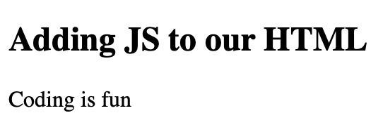
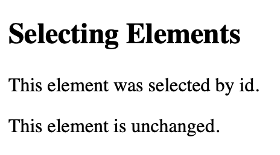
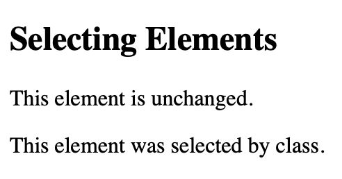
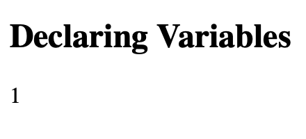
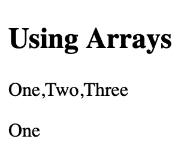
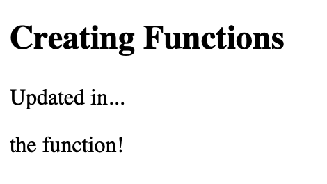
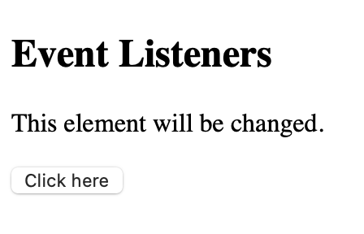
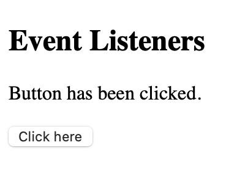

# **Web Design & Dev** - JavaScript

Here is a general overview of some of the JavaScript that we need to know for our project. 

## What is JavaScript 
- Determines the dynamic behaviour of web pages.
- It adds functionality to our website.

## Connecting JavaScript & HTML

### Through the HTML File
- We can add Javascript code to our HTML file by using the `<script>` tag.
- In between the opening and closing `<script>` tags we put our lines of JavaScript code that we want to be executed on for that webpage.

<ins>Example:</ins>

HTML File
```html
<!DOCTYPE html>
<html lang="en">
<head>
    <title>Example</title>
    <link rel="stylesheet" href="style.css">
</head>
<body>
  <h2>Adding JS to our HTML</h2>
  <p id="demo"> </p>

  <script>
    document.getElementById("demo").innerHTML = "Coding is fun"
  </script>
</body>
</html>
```

`=>`

Output



### Through a JS File
- We can create a dedicated JavaScript file to hold all of the dynamic features of the page.
- To do this, we remove any script from the HTML file and instead put it in a `.js` file.
- In the HTML file we need to add `src="<your_filename>.js"` in our opening `<script>` tag.
- Now our HTML file will know to use that specific JS file's script on the webpage.

<ins>Example:</ins>

HTML File
```html
<!DOCTYPE html>
<html lang="en">
<head>
    <title>Example</title>
    <link rel="stylesheet" href="style.css">
</head>
<body>
  <h2>Adding JS to our HTML</h2>
  <p id="demo"> </p>

  <script src="script.js"></script>
</body>
</html>
```

`+`

JS File
```js
document.getElementById("demo").innerHTML = "Coding is fun"
```

`=>`

Output


## Get Element

### Selecting by ID
- You can select a HTML element by it's given ID.
- You must set the ID in the HTML tag and then reference it in the JavaScript file.
- To set the ID in the HTML file use the `id="<id_name>"` attribute.
- To reference it in the Javascript file use the command `document.getElementById("<id_name>")`.

<ins>Example:</ins>

HTML File
```html
<!DOCTYPE html>
<html lang="en">
<head>
    <title>Example</title>
    <link rel="stylesheet" href="style.css">
</head>
<body>
  <h2>Selecting Elements</h2>
  <p id="demo">This element is unchanged.</p>
  <p class="demo">This element is unchanged.</p>

  <script src="script.js"></script>
</body>
</html>
```

`+`

JS File
```js
document.getElementById("demo").innerHTML = "This element was selected by id.";
```

`=>`

Output



### Selecting by Class
- You can select a HTML elements by their class name.
- You must set the class name in the HTML tag and then reference it in the JavaScript file.
- To set the class name use the `class="<class_name>"` attribute.
- To reference it in the Javascript file use the command `document.getElementsByClassName("<class_name>")`.
- **Note:** This Javascript command returns **_all_** elements with this class name, so we have to _index_ the element to modify it directly (see example below).

<ins>Example:</ins>

HTML File
```html
<!DOCTYPE html>
<html lang="en">
<head>
    <title>Example</title>
    <link rel="stylesheet" href="style.css">
</head>
<body>
  <h2>Selecting Elements</h2>
  <p id="demo">This element is unchanged.</p>
  <p class="demo">This element is unchanged.</p>

  <script src="script.js"></script>
</body>
</html>
```

`+`

JS File
```js
document.getElementsByClassName("demo")[0].innerHTML = "This element was selected by class.";
```

`=>`

Output



### Selecting by Query 

Although we will not cover this in class, you may find the `querySelector()` method useful to more directly select a HTML element in Javascript. 

You can learn about the `querySelector()` method [here](https://www.w3schools.com/Jsref/met_document_queryselector.asp).

## Declaring Variables 

Variables are containers for storing data values.

Like other programming languages, we must declare our variables. 

To do this we must use either the use the keyword `let` or `const`, followed by the name we want to give our variable.

You can also assign a value to your variable by adding an `=` after the variable name followed by the value you wish to store.

The `let` keyword allows us to make a variable where we can continuously change its value. When using the `const` keyword, the variable's value may only be assigned once. 

_There is also the keyword `var` but we won't worry about that in this course._

<ins>Example:</ins>

HTML File
```html
<!DOCTYPE html>
<html lang="en">
<head>
    <title>Example</title>
    <link rel="stylesheet" href="style.css">
</head>
<body>
  <h2>Declaring Variables</h2>
  <p id="demo">This element will be changed.</p>

  <script src="script.js"></script>
</body>
</html>
```

`+`

JS File
```js
const demoElement = document.getElementById('demo');

let demoCount = 0;

demoCount += 1;

demoElement.innerHTML = demoCount;
```

`=>`

Output



## Arrays
- Arrays are used to store several items in one variable.
  - We call these items elements.
- Arrays can store a group of datatypes such as strings, integers, HTML elements, etc.
- Elements in an array are indexed.
  - For example, the first item has index `[0]`, the second item has index `[1]` and so on.

<ins>Example:</ins>

HTML File
```html
<!DOCTYPE html>
<html lang="en">
<head>
    <title>Example</title>
    <link rel="stylesheet" href="style.css">
</head>
<body>
  <h2>Using Arrays</h2>
  <p id="demo1">This element will be changed.</p>
  <p id="demo2">This element will also be changed.</p>

  <script src="script.js"></script>
</body>
</html>
```

`+`

JS File
```js
const exampleArray = [
    "One",
    "Two",
    "Three"
];

document.getElementById('demo1').innerHTML = exampleArray;
document.getElementById('demo2').innerHTML = exampleArray[0];
```

`=>`

Output




## Functions
- A function is a block of code that performs a specific task.
- We use them to organize our code into reusable chunks.
  - This means we don't need to repeat the same lines of code over and over in our program
- A function must be _called_ for that code to be executed.

<ins>Example:</ins>

HTML File
```html
<!DOCTYPE html>
<html lang="en">
<head>
    <title>Example</title>
    <link rel="stylesheet" href="style.css">
</head>
<body>
  <h2>Creating Functions</h2>
  <p id="demo1">This element will be changed.</p>
  <p id="demo2">This element will also be changed.</p>

  <script src="script.js"></script>
</body>
</html>
```

`+`

JS File
```js
// Creating the function
function updateDemo() {
  document.getElementById('demo1').innerHTML = "Updated in...";
  document.getElementById('demo2').innerHTML = "the function!";
}

// Calling the function
updateDemo();
```

`=>`

Output




## Event Listeners 
- Event listeners allow us to set up a specific function to run when an event occurs on the webpage.
- Some common events to listen for are clicks, hovers, or key presses.
- We use `addEventListener()` to attach an event to a HTML element.
- The first parameter specifies the type of event
  - For example `click`, `mouseover`, `keydown`, etc.
  - A list of all possible events can be found [here](https://www.w3schools.com/jsref/dom_obj_event.asp).
- The second parameter is the function that runs when that event occurs.

<ins>Example:</ins>

HTML File
```html
<!DOCTYPE html>
<html lang="en">
<head>
    <title>Example</title>
    <link rel="stylesheet" href="style.css">
</head>
<body>
  <h2>Event Listeners</h2>
  <p id="demo">This element will be changed.</p>
  
  <button id="demo-btn">Click here</button>

  <script src="script.js"></script>
</body>
</html>
```

`+`

JS File
```js
const btn = document.getElementById("demo-btn");
const text = document.getElementById("demo");

btn.addEventListener('click', function() {
    text.innerHTML = "Button has been clicked."
});
```

`=>`

Output

_Before click:_



_After click:_



